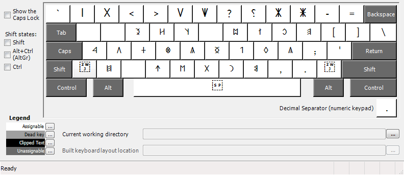
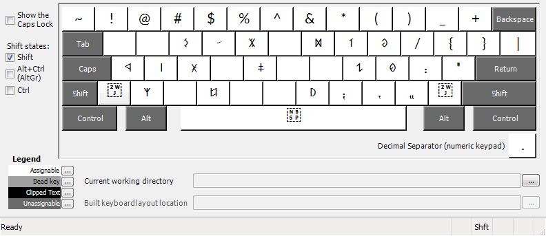
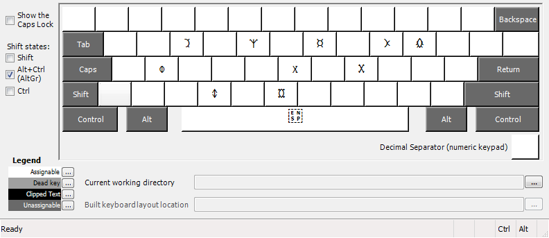
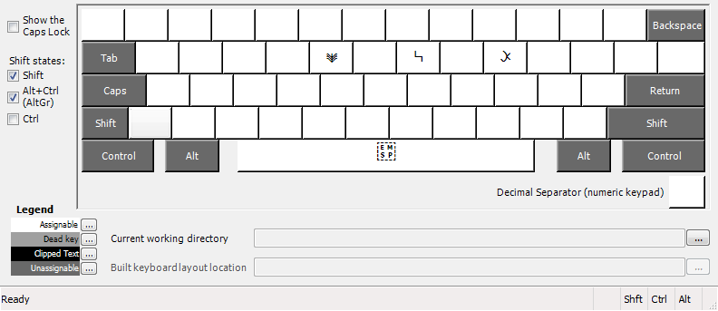

Old Hungarian (Hungarian Runic) keyboard layout
===============================================

This is a keyboard layout to make Old Hungarian (Hungarian Runic) Unicode
characters easy to enter. It should be used in conjunction with an Old
Hungarian display font, such as
[this one](https://github.com/OldHungarian/old-hungarian-font).

To build, use Microsoft's
[Keyboard Layout Creator](https://msdn.microsoft.com/en-us/globalization/keyboardlayouts.aspx).

Design decisions
----------------

In this current version, only the "small" characters from the Unicode set are
used, and not the "capitals". The only difference between the two is their size,
and it seems better to include all the characters than to have two sizes of
only a majority of characters with several missing.

Also, note the the following characters are not represented on the keyboard,
as they are not present in the Old Hungarian Unicode block: DZ, DZS, Q, W, X, Y.
In some fonts, as in the one linked above, they are represented as ligatures.
The zero-width joiner character (U+200D) has been added to both the left and
right sides of the keyboard for ease in creating these ligatures.

Since not all digits are represented in Old Hungarian (for example, 2 is
represented as 11), the unused digit keys are used for punctuation and other
symbols.

Unshifted keyboard layout
-------------------------

Keyboard layout with Shift key
------------------------------

Keyboard layout with AltGr key (or Ctrl-Alt)
--------------------------------------------

Keyboard layout with AltGr and Shift keys
-----------------------------------------

License
=======

    Copyright 2016 Stacey Adams

    Licensed under the Apache License, Version 2.0 (the "License");
    you may not use this file except in compliance with the License.
    You may obtain a copy of the License at

       http://www.apache.org/licenses/LICENSE-2.0

    Unless required by applicable law or agreed to in writing, software
    distributed under the License is distributed on an "AS IS" BASIS,
    WITHOUT WARRANTIES OR CONDITIONS OF ANY KIND, either express or implied.
    See the License for the specific language governing permissions and
    limitations under the License.

